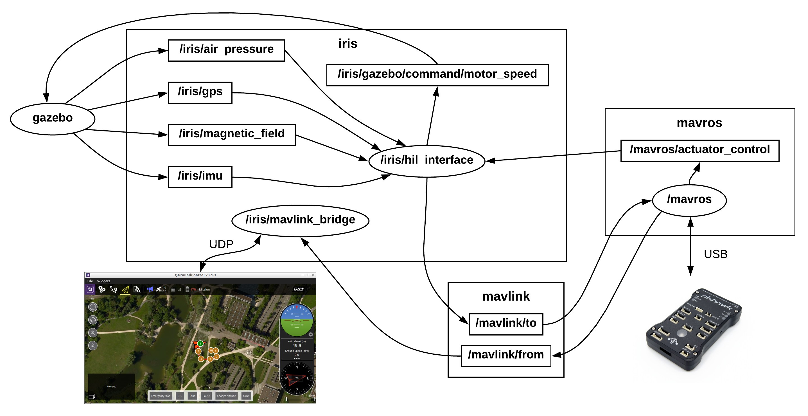

Gazebo Quadrotor Simulator (hardware-in-the-loop)
=============================

**This project is a part of [StarryPilot](https://github.com/JcZou/StarryPilot) autopilot software**

# Usage
The simulator is tested in **ROS kinetic**, for other distributions, it is not well tested.
- *Download*

Download all packages, and move them into **src** directory of ROS workspace.
- *Compile packages*

In ROS workspace, execute `catkin build`. (you may need to install )

- *Launch mavros*

`roslaunch mavros starry.launch`

- *launch gazebo* 

`roslaunch rotors_gazebo starry_hil.launch`

To execute the simulation, you should set [**StarryPilot**](https://github.com/JcZou/StarryPilot) autopilot firmware to **HITL mode**.
